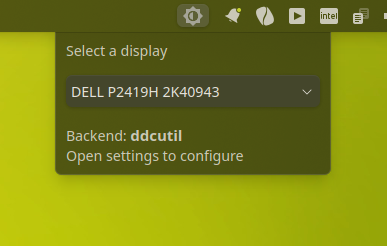
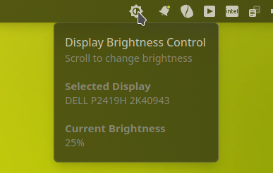
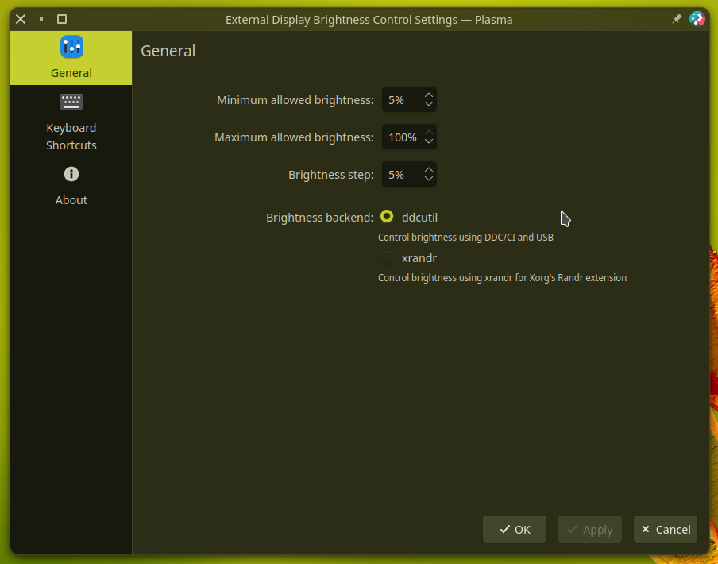

# External Display Brightness Control
</td>

Control external displays brightness through various backends.
 
**DISCLAIMER: this widget is under active development and may contain bugs that could cause your display temporary unusable**

# Current & planned features 
- [x] Step size
- [x] Max & Min brightness
- [x] Multi Monitor/Backends support
- [x] Systray support
- [x] Slider, like the default battery applet
- [ ] Saving monitor selection across sessions
- [ ] Check and enable available backends only

**Brightness backends**
  - [x] [ddcutil](https://github.com/rockowitz/ddcutil) Control brightness using DDC/CI and USB
    - [ ] Multiplication factor for DDC sleeps `--sleep-multiplier` (faster response)
    - [ ] Do not read VCP value after setting it `--noverify` (faster response)
    - [ ] Detect USB devices `--enable-usb`
  - [x] [xrandr](https://www.x.org/releases/X11R7.6/doc/man/man1/xrandr.1.xhtml) Control brightness using xrandr for Xorg's Randr extension
  - [x] [light](https://github.com/haikarainen/light) Control monitor using light for ACPI backlight controllers

# Screenshots
 <table>
  <tr>
    <td> </td>
    <td> </td>
    <td> </td>
   </tr> 
  </tr>
</table>

# Acknowledgements
[Misagh's (@Misaghlb)](https://github.com/Misaghlb) [plasma-applet-brighty](https://github.com/Misaghlb/plasma-applet-brighty), the base this plugin builds upon

[Ismael Asensio's (@ismailof)](https://github.com/ismailof) [mediacontroller_plus](https://github.com/ismailof/mediacontroller_plus) and [Chris Holland's (@Zren)](https://github.com/Zren)  [plasma-applet-commandoutput](https://github.com/Zren/plasma-applet-commandoutput) plugins for some configuration and command handling bits

[Alexey Varfolomeev (@varlesh)](https://github.com/varlesh) for the icon